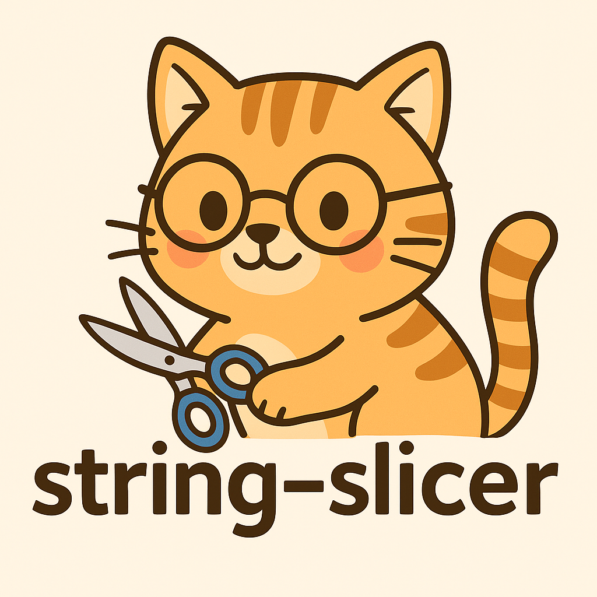

# 🧵 String Slicing Exercises

This folder contains my string manipulation and slicing exercises from Week 3 of the Helsinki Python MOOC.
Expect some slicing, dicing, indexing, and maybe a little frustration, but nothing a cat with scissors can’t handle.
This is actually my second time going through week 3 and so far (knock on wood) some of what frustrated me before is slightly clearer now.
